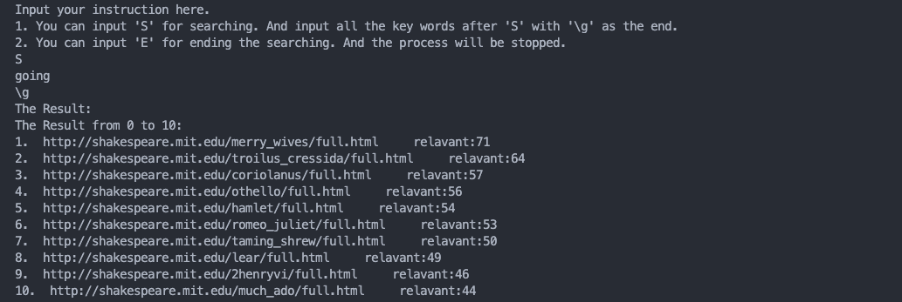

# MiniSearch

## Project description

In this project, we are supposed to create your own mini search engine which can handle inquiries over “The Complete Works of William Shakespeare” (http://shakespeare.mit.edu/).

Our tasks are:
(1) Run a word count over the Shakespeare set and try to identify the stop words (also called the noisy words) – How and where do you draw the line between “interesting” and “noisy” words?
(2) Create your inverted index over the Shakespeare set with word stemming. The stop words identified in part (1) must not be included.
(3) Write a query program on top of your inverted file index, which will accept a user-specified word (or phrase) and return the IDs of the documents that contain that word.
(4) Run tests to show how the thresholds on query may affect the results.

## Environment & Introduction Knowledge

### OS
We suggest you using Linux or MacOS. If you are using Windows, you can use WSL or Git Bash to run `test.sh`.

### Other tools
- `filesystem` for higher than C++17
- `cmake` for higher than 3.10
- `python` for higher than 3.X
- The required python packages are listed in `requirements.txt`. You can install them by running `pip install -r requirements.txt`.

    <b>
Reference</b>
  

### Stemmer
[Porter Stemmer](https://github.com/pisa-engine/Porter2) is used in this project. It is a C++ implementation of the Porter Stemmer algorithm. The original algorithm was published by Martin Porter in 1980. 

### Stop Words
[Cppreference Stop Words](https://cplusplus.com/forum/beginner/249776/) is used in this project. It is a list of stop words in English.

## Project design & code details  

### Picking information from web pages  

We use the `requests` and `BeautifulSoup` libraries in Python to obtain the required information from the web page. You can see the code details in `/request.py`.  

- The required packages are listed in `requirements.txt`. You can install them by running `pip install -r requirements.txt`.
- Of course, you can modify the url in our `request.py` to build your own lib.

### Establish all required index files  

#### Overall approach:  

On the basis of the previous section, traverse all articles (processed by stemmer and stop words function).  

Process one word at a time: Insert the current article number into the container that records the occurrence of the word using the insert() function, or add one to the number of occurrences of the article number.  

For memory considerations, whenever a word's container contains more than a certain number of elements, it is written to the index file and the container is emptied.  

Repeat this process until all the articles are processed.  

#### How to read the files  
##### How to read the file containing all the articles:

As you see in the graph, we use `filesystem` to read the file containing all the articles in the data directory.

##### How to give the file a number:
As you can see when run the main program, the files are not read in order for some reasons. However, in our database(four files - ALLfile.txt, blockfile.txt, HTMLfile.txt, INDEXfile.txt), they are corresponding to each other. 

##### What information is written to the index file:
The index file is a binary file, and the invert index information written to it is the occurrence of each word in each article. 

blockfile.txt records the different words blocks information in INDEXfile.txt.

`ALLfile.txt - HTMLfile.txt - INDEXfile.txt` are corresponding to each other.

#### The `insert()` function  

The code for the entire function is shown below, which will be explained in detail later.  

	//Insert a word into the dictionary
	void insert(string x, string essay, FILE *ofINDEX)
	{
		auto location = INDEX.find(x);
		if(location == INDEX.end())     //The word doesn't exist in the dictionary
		{
			vector<Posi>* posting_point = new vector<Posi>; //Build a posting list
			Posi newpost = {FILE_ID[essay], 1};             //the id ofthe essay and number of occurrences
			(*posting_point).push_back(newpost);   //insert the new node into the posting list
			INDEX.insert(INDEX_VALUE(x, posting_point));
		}
		else    //The word already exists
		{
			vector<Posi>* posting_point = (*location).second;
	
			int flag = 1;   //flag = 1, means current word has not appeared in the essay yet
			for(int i=0;i<(*posting_point).size();i++)
			{
				if((*posting_point)[i].essay == FILE_ID[essay])
				{
					flag = 0;
					(*posting_point)[i].times++;    //if this word has appeared in this essay, just add one to the 'times'
					break;
				}
			}
			if(flag)       //insert a new node into the posting list
			{
				Posi newpost = {FILE_ID[essay], 1};
				(*posting_point).push_back(newpost);
			}
	
			int size = (*posting_point).size();
			if(size == BLOCK)   //the posting list has a length of 1000, then write it into the file
			{
				Posi temp_pose[size];
				for(int i=0;i<size;i++)
				{
					temp_pose[i] = (*posting_point)[i]; //copy all the data into a buffer
				}
				
				fwrite((char*)temp_pose, sizeof(char), 1000*sizeof(Posi)/sizeof(char), ofINDEX);
				(*posting_point).clear();           //remove the data which has been writen into file
	
				auto it = BLOCK_ID.find(x); 
				if(BLOCK_ID.end() == it)            //If there isn't a block list for current word yet
				{
					vector<int>* block_point = new vector<int>;
					(*block_point).push_back(blocknum);
					BLOCK_ID.insert(pair<string, vector<int>*>(x, block_point));
					blocknum++;
				}
				else    //If there exists
				{
					vector<int>* block_point = (*it).second;
					(*block_point).push_back(blocknum);  //just add a block id
					blocknum++;
				}
			}
		}
	}  

Function declaration: `void insert(string x, string essay, FILE *ofINDEX)`
As we can see, this function requires passing in three parameters: namely the current word(string x), article name(string assay), and pointer to write to the file(FILE *ofINDEX).  

We use a STL container map to map words to a variable array that records their occurrence positions. The specific declaration of this map is as follows:  

	typedef map<string, vector<Posi>*> INDEX_TYPE;      //the dictionary INDEX
	typedef pair<string, vector<Posi>*> INDEX_VALUE;    //the value type of the dictionary
	static INDEX_TYPE INDEX;  

where `Posi` is structure, contains `{int essay, int times}`, which stand for the id of current essay and the times of occurrence in this essay.  
(Becaus map is in fact a search tree with sufficient efficiency, it is very suitable to use it to create inverted indexes.)  

At the beginning of this function, we use the `find()` function that comes with the map to check if the word is already in our dictionary. If not, then we need to create a new vector pointer and use the new keyword to request a space for it that will not be automatically released. And insert the current article number and the number of occurrences '1':  

	auto location = INDEX.find(x);
	if(location == INDEX.end())     //The word doesn't exist in the dictionary
	{
		vector<Posi>* posting_point = new vector<Posi>; //Build a posting list
		Posi newpost = {FILE_ID[essay], 1};             //the id ofthe essay and number of occurrences
		(*posting_point).push_back(newpost);   //insert the new node into the posting list
		INDEX.insert(INDEX_VALUE(x, posting_point));
	}  

Else we will firstly check if the word has already appeared in current essay before. If not, we need to add a new point(in fact a structure `Posi`) to the posting list. If yes, we simply add 1 to the times of corresponding nodes:  

	else    //The word already exists
	{
		vector<Posi>* posting_point = (*location).second;
	
		int flag = 1;   //flag = 1, means current word has not appeared in the essay yet
		for(int i=0;i<(*posting_point).size();i++)
		{
			if((*posting_point)[i].essay == FILE_ID[essay])
			{
				flag = 0;
				(*posting_point)[i].times++;    //if this word has appeared in this essay, just add one to the 'times'
				break;
			}
		}
		if(flag)       //insert a new node into the posting list
		{
			Posi newpost = {FILE_ID[essay], 1};
			(*posting_point).push_back(newpost);
		}  
	
		......  
	
		else    //If there exists
		{
			vector<int>* block_point = (*it).second;
			(*block_point).push_back(blocknum);  //just add a block id
			blocknum++;
		}  

Then, we should  check if the vector has a size of 1000. If yes, then the content will be directly written in block form into indexfile.txt for future queries. After the write operation is completed, clear the contents of the vector.  
Since the index file is written in the form of blocks, we can actually achieve quick lookup in the index file by recording the block number corresponding to the posting list of each word. Based on this concept, we will establish another map to map words and a variable array for storing block numbers: `static map <string, vector<int>*> BLOCK_ID`  

	int size = (*posting_point).size();
	if(size == BLOCK)   //the posting list has a length of 1000, then write it into the file
	{
		Posi temp_pose[size];
		for(int i=0;i<size;i++)
		{
			temp_pose[i] = (*posting_point)[i]; //copy all the data into a buffer
		}
		
		fwrite((char*)temp_pose, sizeof(char), 1000*sizeof(Posi)/sizeof(char), ofINDEX);
		(*posting_point).clear();           //remove the data which has been writen into file
	
		auto it = BLOCK_ID.find(x); 
		if(BLOCK_ID.end() == it)            //If there isn't a block list for current word yet
		{
			vector<int>* block_point = new vector<int>;
			(*block_point).push_back(blocknum);
			BLOCK_ID.insert(pair<string, vector<int>*>(x, block_point));
			blocknum++;
		}  

Finally, after all words have been processed by the insert function, we have actually implemented the following functions:
For each input of a key word, we can determine which blocks of the posting list exist in the index file through BLOCK ID;
Due to the fact that the storage method of the index file is block by block, we can quickly read out all the article numbers and times that the keyword appears through the fresh function.
From this, we have achieved fast keyword queries.

### Query section   

As mentioned earlier, in the query stage, we only need to perform a search operation on each input keyword according to the above principle, in order to know the number of times that word appears in each article. The above principle can be illustrated in one diagram as follows:  

   

In actual code implementation, we use the following method: using an array `relative []` to record the relevance of each article and keywords, and after the query for all keywords is completed, we use quick sorting to achieve the output of relevance from high to low;  
Simultaneously create a synchronized array `mark_id []`, initialize it as `mark_id [i] = i`, and make corresponding exchanges along with the relative sorting, to achieve the correctness of ID mapping after sorting (because we need to find the correct file name through FILE_ID).  

The specific query operation is completed by the `search()` function. This function is declared as `void search(string x, int relavant[])`, where `x` is the key word and relavant[] is the correlation array.The overall function is as follows:  

	//for each call of search(), only search one key word
	//relavant is used to record the relevance between articles and keywords
	void search(string x, int relavant[])
	{
		auto location = BLOCK_ID.find(x);
		if(location == BLOCK_ID.end())	    //which means no such key word				
		{
			return;
		}
	
		FILE *ofINDEX = fopen("INDEXfile.txt", "rb");
		if((*(BLOCK_ID[x])).size() != 0)
		{
			for(int i = 0; i < ((*(BLOCK_ID[x])).size()); i++)
			{
				Posi block_temp[1001];
				int block_num = (*(BLOCK_ID[x]))[i];
				fseek(ofINDEX, block_num*1000*sizeof(Posi), SEEK_SET); //read the blocks with the help of block ID
				fread((char*)block_temp, sizeof(char), 1000*sizeof(Posi)/sizeof(char), ofINDEX);
				for(int j = 0; j < 1000; j++)
				{
					if(block_temp[j].essay == -1) break;
					relavant[block_temp[j].essay] += block_temp[j].times;
				}
			}
		}
		fclose(ofINDEX);
		return;
	}   

Firstly, determine if the keyword is present. We can query through the `find (x)` function of the map:  

	auto location = BLOCK_ID.find(x);
	if(location == BLOCK_ID.end())	    //which means no such key word				
	{
		return;
	}  

Next, there are several steps to take:
1. Open the indexfile;  `FILE *ofINDEX = fopen("INDEXfile.txt", "rb");`
2. Read the block number of the word in the index file from BLOCK_ID;  
3. Move the file pointer to the beginning of the corresponding block using the fseek function;
4. Use the fresh function to read the entire block of data into a buffer;
5. Based on the data in the buffer, perform corresponding operations on the relative array.
6. If the current word still has a BLOCK ID, repeat steps 2-5 until all blocks have been processed.    

	if((*(BLOCK_ID[x])).size() != 0)
	{
		for(int i = 0; i < ((*(BLOCK_ID[x])).size()); i++)
		{
			Posi block_temp[1001];
			int block_num = (*(BLOCK_ID[x]))[i];
			fseek(ofINDEX, block_num*1000*sizeof(Posi), SEEK_SET); //read the blocks with the help of block ID
			fread((char*)block_temp, sizeof(char), 1000*sizeof(Posi)/sizeof(char), ofINDEX);
			for(int j = 0; j < 1000; j++)
			{
				if(block_temp[j].essay == -1) break;
				relavant[block_temp[j].essay] += block_temp[j].times;
			}
		}
	}  

After searching for all keywords, quickly sort them based on the relative array and select the articles with the highest relevance. The code is shown below. Due to the simplicity of quick sorting, there is no need for further explanation.

	//quick sort, used to find the most relavant essays
	void sort(int relavant[], int mark_id[], int l, int r)
	{
		if(l >= r) return;
		int ls = l, rs = r;
		int mid = (ls + rs)/2;
		swap(mark_id[mid], mark_id[ls]);
		swap(relavant[mid], relavant[ls]);
		
		while(l<r)
		{
			while((-1)*relavant[r]>=(-1)*relavant[ls] && r>l) r--;
			while((-1)*relavant[l]<=(-1)*relavant[ls] && r>l) l++;
			if(r != l)
			{
				swap(mark_id[l], mark_id[r]);
				swap(relavant[l], relavant[r]);
			}
		}
		swap(mark_id[ls], mark_id[l]);
		swap(relavant[ls], relavant[l]);
		sort(relavant, mark_id, ls, l-1);
		sort(relavant, mark_id, l+1, rs);
		return;
	}  

### Design at the usage level  

#### Only query, do not rebuild index  

At the beginning of the main() function, the user is required to input instructions to determine whether to rebuild the index (because rebuilding the index requires traversing all articles and has a high time complexity). If not, since all required information has already been stored in various files, simply enter the query phase.  

	int build_flag = 1;
	string BUILD_INS;
	cin>>BUILD_INS;
	if(BUILD_INS == "re")
	{
		build_flag = 0;
		...
	}
	
	//query section
	if(build_flag)
	{
		...
	}  

In the above code, build_flag is used to record whether reconstruction has been performed. Because we hope to continue using the previous search function, if reconstruction is not performed, we will need to read the data from the corresponding file into the corresponding container, specifically Catalog, FILE-ID, and BLOCK-ID. Used to establish mapping from number to article, mapping from article to number, and storing all block numbers:  

	int cnt2 = 0;
	if(build_flag)
	{
	    ifstream ifblock("blockfile.txt");
	    int num;
	    string snum;
	    string key;
	    while(!ifblock.eof())
	    {
	        ifblock>>key;
	        ifblock>>snum;
	        char NUMS[snum.size()+1];
	        for(int i=0;i<snum.size();i++)
	        NUMS[i] = snum[i];
	        NUMS[snum.size()] = '\0';
	        num = atoi(NUMS);
	
	        int buffer[num+1];
	        for(int i=0;i<num;i++)
	        ifblock>>buffer[i];
	        vector<int>* blocklist = new vector<int>;
	        for(int i=0;i<num;i++)
	        (*blocklist).push_back(buffer[i]);
	        BLOCK_ID.insert(pair<string, vector<int>*>(key, blocklist));
	        cnt2++;
	    }
	    ifblock.close();
	
	    int cnt3=0;
	    string name;
	    ifstream ifall("ALLfile.txt");
	    while(!ifall.eof())
	    {
	        ifall>>name;
	        Catalog.push_back(name);
	        FILE_ID.insert(pair<string, int>(name, cnt3));
	        cnt3++;
	    }
	    file_num = cnt3;
	}  

The above code snippet implements this function.  
After these preparations, we can directly enter the query section.  

#### Page wise display of articles  

At the beginning of entering the query, the command S or E is used to determine whether to proceed with the query or end the process.  

	while(1)
	{
	    string key, instruction;
	    int relavant[file_num], mark_id[file_num];
	    for(int i=0;i<file_num;i++)
	    {
	        mark_id[i] = i;
	        relavant[i] = 0;
	    }
	    //system("CLS");
	    cout<<"Input your instruction here."<<endl;
	    cout<<"1. You can input 'S' for searching. And input all the key words after 'S' with '\\g' as the end."<<endl;
	    cout<<"2. You can input 'E' for ending the searching. And the process will be stopped."<<endl;
	    cin>>instruction;
	    if(instruction == "E")
	    break;
	    else if(instruction != "S")
	    continue;
		...
	}  

Because the number of articles retrieved at once is quite large, we only display ten at a time and control the page forward or backward through instructions. The specific code is as follows:  

	cout<<"The Result: "<<endl;
	int range = 0;
	for(int i=range;i<range+10 && i<file_num;i++)
	cout<<i+1<<".  "<<Catalog[mark_id[i]]<<"     relavant:"<<relavant[i]<<endl;
	cout<<range<<"--"<<range+10<<endl<<endl;
	while(1)
	{
		cout<<"Input your instruction here:"<<endl;
		cout<<"1. sp: show the previous 10 essays."<<endl;
		cout<<"2. sn: show the next 10 essays."<<endl;
		cout<<"3. ns: go to the next searching."<<endl;
		string instruction2;
		cin>>instruction2;
		if(instruction2 == "sp") //show previous 10 essays
		{
			if(range >= 10)
			range-=10;
			system("CLS");
			for(int i=range;i<range+10 && i<file_num;i++)
			cout<<i+1<<".  "<<Catalog[mark_id[i]]<<"     relavant:"<<relavant[i]<<endl;
			cout<<range<<"--"<<range+10<<endl<<endl;
		}
		else if(instruction2 == "sn")    //show next 10 essays
		{
			if(range+10 < file_num)
			range+=10;
			system("CLS");
			for(int i=range;i<range+10 && i<file_num;i++)
			cout<<i+1<<".  "<<Catalog[mark_id[i]]<<"     relavant:"<<relavant[i]<<endl;
			cout<<range<<"--"<<range+10<<endl<<endl;
		}
		else if(instruction2 == "ns")    //next search
		{
			system("CLS");
			break;
		}
	}  

## Test results  
### Time analysis
#### Request for html txt
There are 1021 files, and it almost need 5min.

Of course, you can modify the url in our `request.py` to build your own lib.

#### Main.Cpp
If you want to re-build your database. It need 3mins for Shakespeare.

Once you've built database(ALLfile.txt blockfile.txt HTMLfile.txt INDEXfile.txt). It runs less than 0.1s.

### File read accuracy
The system ls *.txt to show the number of data files in the current directory.

The program reads the file and outputs the number of data files read.

When we do not use 're' to rebuild the index, the program reads the data from the file and outputs the number of data files read.

### Stemmer and stop words Test

#### Stemmer

| Original word | Past Tense word |
| ------------- | ------------ |
| |  |

| Original word | Present Tense word |
| ------------- | ------------ |
| |  |

| Original word | Third person singular |
| ------------- | ------------ |
|  |  |

| Original word | Plural word |
| ------------- | ------------ |
| |  |

#### Stop words

#### Multi-word Test

**HAMLET single word test:**

Meanwhile, you can search the scene where the word appears in the Hamlet play.

It could be verified that the program can correctly read the data from the file and the stemmer and stop words function works well.

##### Similar Test

**Simple multiple words test:**

**Multiple stop words test:**

It's same as the following test, the program can correctly read the data from the file and the stemmer and stop words function works well.

**Multiple words test:**
| Simple word | Stemmer word |
| ------------- | ------------ |
| | |

It's all the **same and correct!!!**

## Discussion

We've struggled for this project 4 days. The journey to developing our mini-search engine has been an enlightening and rewarding experience that has not only honed our technical skills but also underscored the power of collaborative effort. Our team embarked on this project with a clear vision: to create a search engine that could efficiently retrieve information from a vast corpus of data using inverted indexing and a bespoke database management system.

The project began with a solid foundation of understanding the underlying principles of information retrieval. We delved into the intricacies of inverted indexing, a technique that allows for quick and precise searching by mapping the relationships between terms and the documents they appear in. This was crucial for the speed and accuracy of our search engine, as it enabled us to bypass the traditional, time-consuming full-text scan.

Implementing our own database's I/O operations was another pivotal aspect of the project. It was a challenging task that required meticulous planning and execution. By designing our database from the ground up, we gained a deep understanding of how data is stored and retrieved, which is central to the performance of any search engine. This hands-on experience with database management systems has been invaluable, providing insights that go beyond theoretical knowledge.

Throughout the development process, our team faced numerous obstacles, from refining our algorithms to optimizing our I/O operations. However, these challenges only served to strengthen our resolve and foster a spirit of innovation. Each member brought unique perspectives and skills to the table, and our collective problem-solving approach was the key to overcoming the hurdles we encountered.

The successful completion of the mini-search engine is a testament to our team's dedication and hard work. It has been a transformative experience that has not only improved our technical proficiency but also our ability to communicate, collaborate, and innovate. This project has instilled in us a sense of accomplishment and a renewed enthusiasm for tackling complex problems in the realm of computer science.

## Declaration

  

    <b>
We hereby declare that all the work done in this project titled 
"Mini-search" is of our independent effort.</b>
  

