

# 个人介绍

2024 Spring

By [混合2207 杜宗泽](https://github.com/Yaoyaolingbro)

2024.3.15&emsp;&emsp;&emsp;

<!--s-->

# Part.1 个人背景

<!--v-->

## 自我介绍
各位老师好，我是杜宗泽,混合2207团支部的团支书。 
我还是浙江大学超算队([ZJUSCT](https://www.zjusct.io/))的一员。

    

        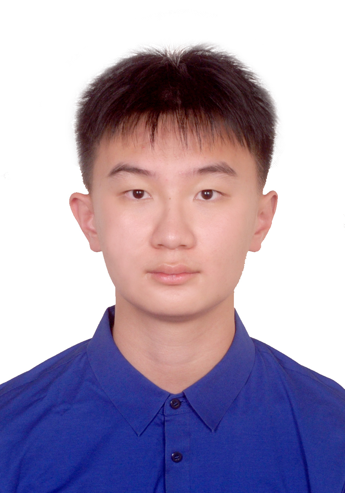
    

    

        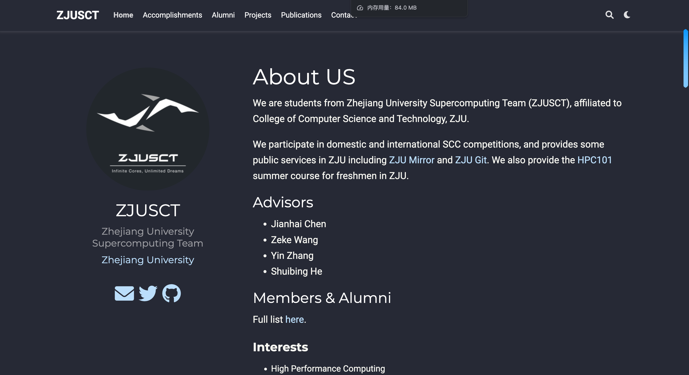
    

<!--v-->

## ZJUSCT

在浙江大学超算队，我积极参与各种科研项目和竞赛，不断提升自己的技术能力和团队合作能力,同时也认识到一群非常优秀的同学。

<!--v-->

## ZJUSCT

在浙江大学超算队，我积极参与各种科研项目和竞赛，不断提升自己的技术能力和团队合作能力，同时也认识到一群非常优秀的同学。

我们也在最近的ASC（世界大学生超算竞赛初赛）中取得了二等奖的好成绩，也将在四月初跟队一起去上海参加决赛。

    

        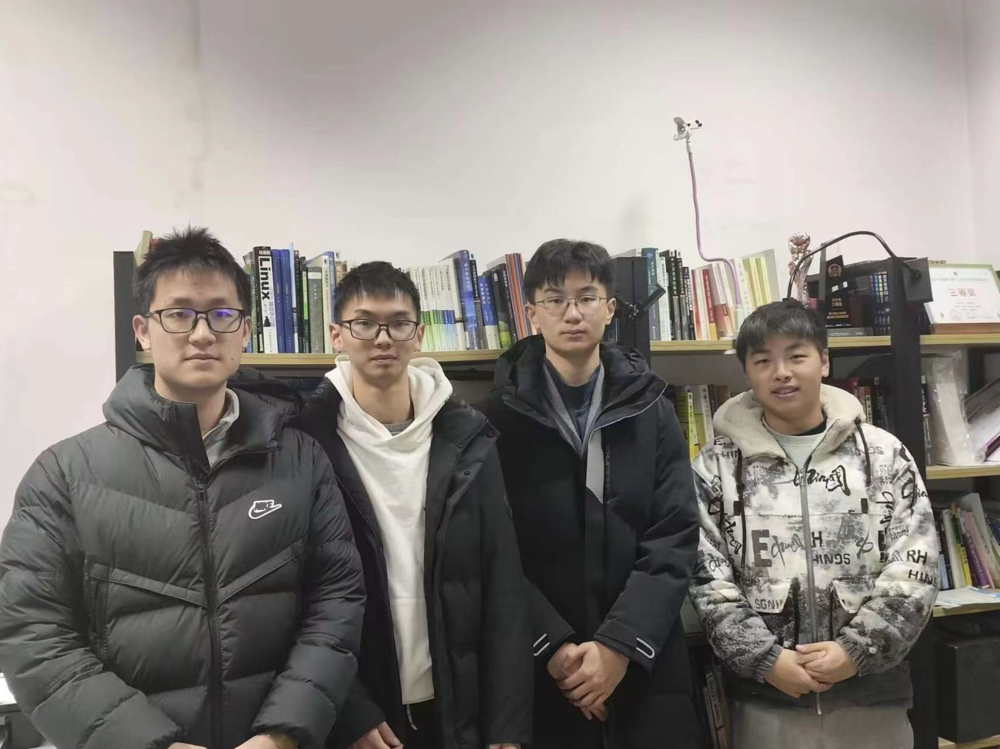
    

    

        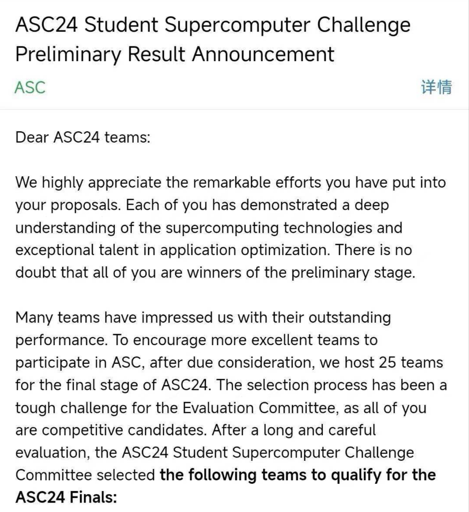
    

<!--v-->

## 我的朋友们
同样，我认为大学的生活不应当仅局限于学术，我也积极参与各种社团活动，结交了一群志同道合的朋友。 
大一我在团委学研和全媒体视觉担任干事。在这里，我深切感受到青年之热情，并且学习了很多摄影技巧。 
大二我在全媒体国际化部门，想要更进一步锻炼自己的英语技巧。

    

        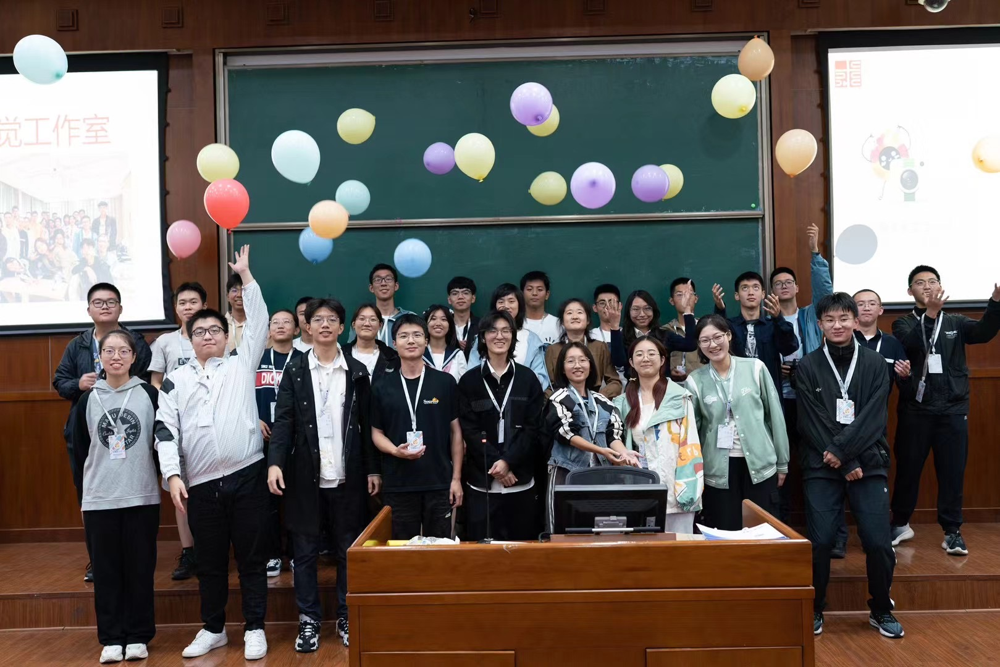
    

    

        
    

<!--v-->

## 生活与我
当然，个人生活于我而言是十分重要的一环。
我会在天气好的适合和朋友一起去游山玩水。我也会在闲暇时阅读填充自己。 
每周我会健身2-3次，也会去三两好友打斯诺克🎱。

<!--v-->

## 生活与我
当然，个人生活于我而言是十分重要的一环。
我会在天气好的适合和朋友一起去游山玩水。我也会在闲暇时阅读填充自己。 
每周我会健身2-3次，也会去三两好友打斯诺克🎱。

    

        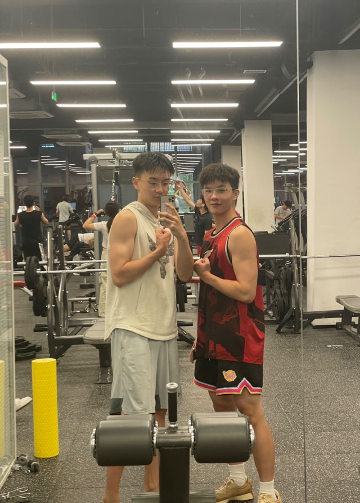
    

    

        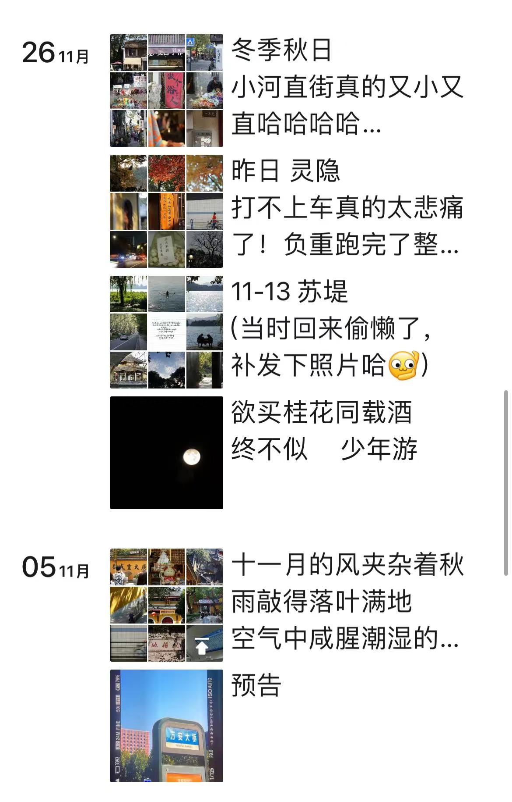
    

    

        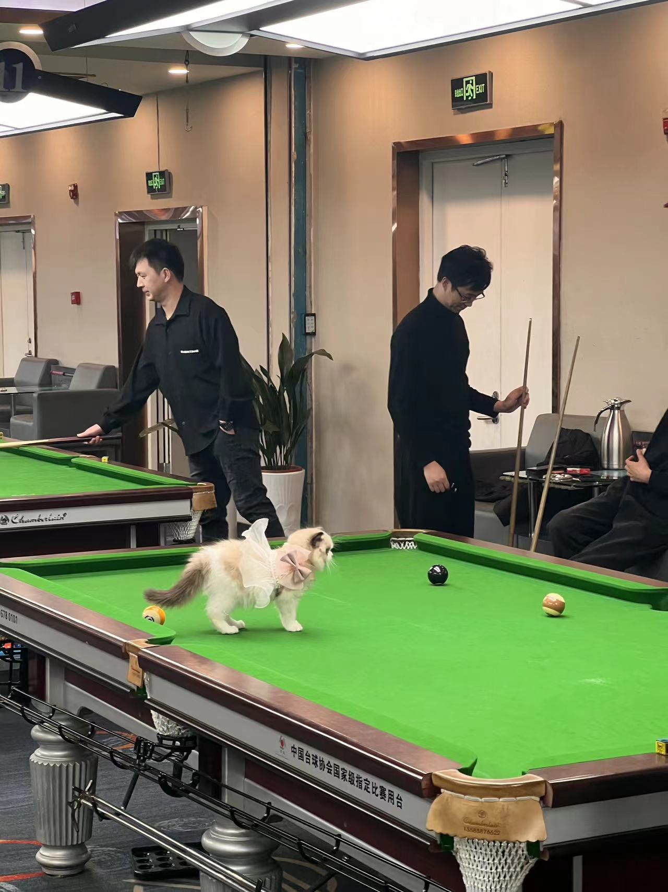
    

<!--s-->

# Part.2 科研经历与规划

<!--v-->

## 初窥技能拾遗小老师
在上学期，我参加了计算机学院朋辈辅学计划，和王淳一起担任了《技能拾遗》课程的小老师。 
在教学的过程中也夯实了自己的知识，也萌生了对于教育的兴趣。

    

        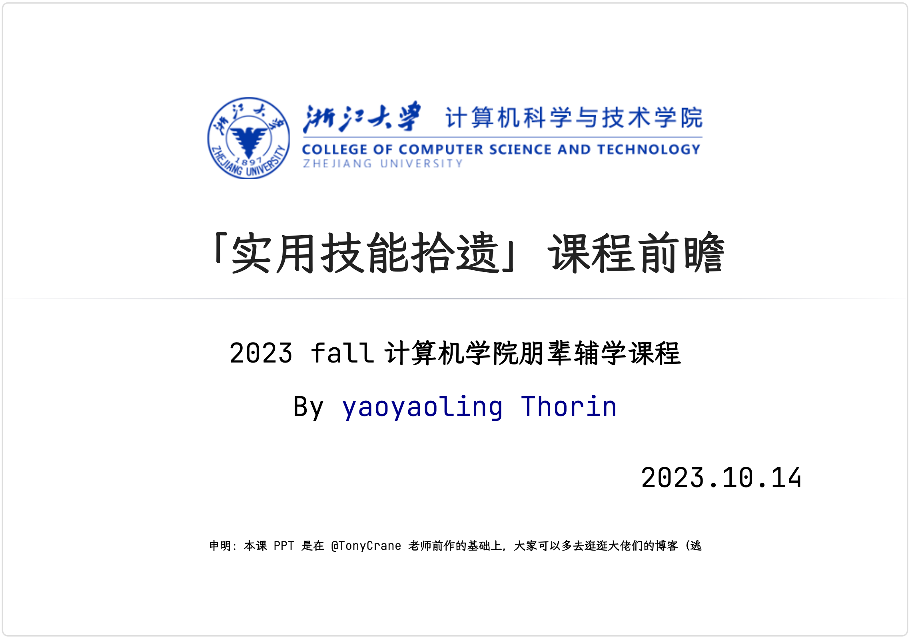
    

    

        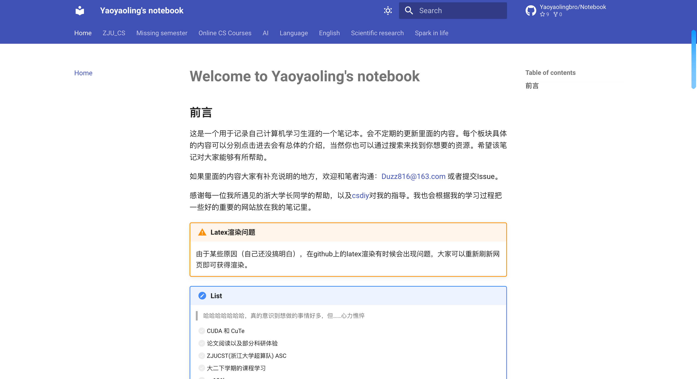
    

<!--v-->

## 科研准备
很庆幸自己大一暑假在超算队三个月的磨砺。（当然也让我初窥计算机硬件的奥秘） 
我已然能够熟练编写CUDA、pytorch等代码，以及常见的NNModel。以及基础工具的使用。

    

        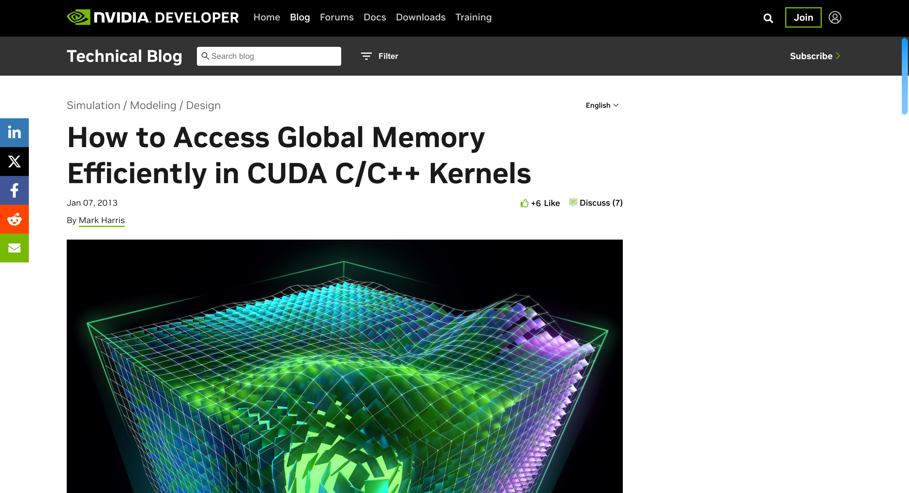
    

    

        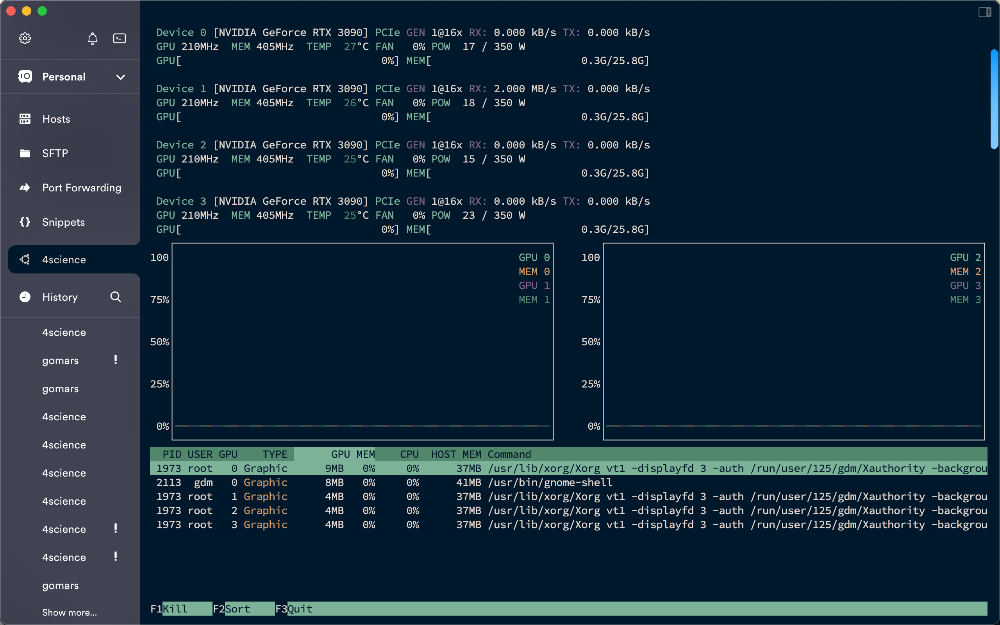
    

<!--v-->

## Speech初窥科研门径
在大二上学期，通过导师制选择了赵洲教授并且进入组内学习TTS。 
我熟练了科研的pipeline以及自己上手了baseline的基本技巧与代码。

    

        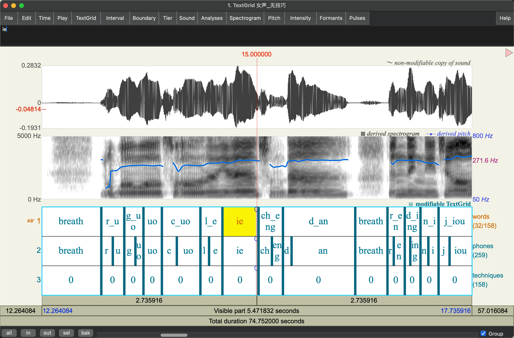 
    

    

        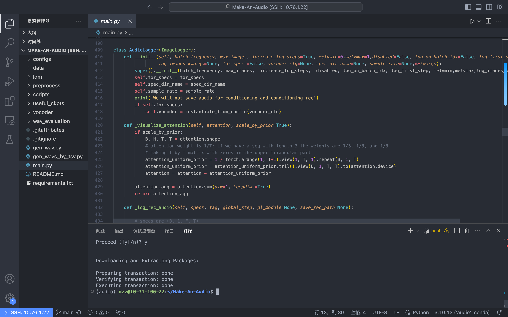
    

<!--v-->

## 现在的我
这学期才本博贯通机遇的促使下，我有幸进入到沈春华教授的组内进行 AI4science 的学习。 
现在我通过restruct师兄之前的代码来学习之前组内的工作，并且积累生物知识构思自己的idea。 
于此同时，在本周三与同学的讨论中，我们已经关于Make-an-audio模型的基础上对乐器拓宽有了一定的构思，在赵洲老师指点下进行srtp以及paper的准备工作。

<!--s-->

# Part.3 对于本博贯通的想法与期待

​

<!--v-->
## 自己的一点尝试

在今年寒假，我和学弟学妹三人参加了美国大学生数学建模比赛。 
在四天的时间里，我们通过构思、编程、论文写作等一系列工作，最终将自己的想法转化实现并完成了一篇论文。 
我品尝到了一丝丝"科研"的喜悦🥳

<!--v-->

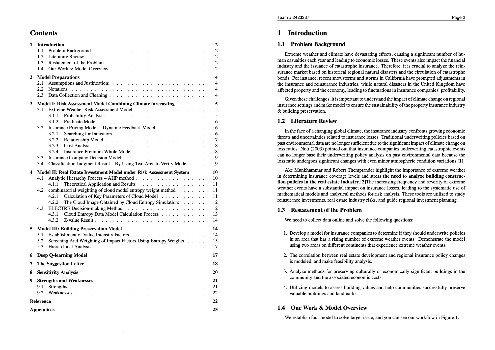

<!--v-->

## 对于本博贯通的想法
在过去一年半的探索中，我逐渐认清自己内心想要。 
我对科研以及科学的未来有着属于自己内心的一种喜爱与渴求。 
而本博贯通恰恰是一个非常好的机遇🎉。

<!--s-->

# 恳请批评指正！

