

# 基于蛋白质联合表征的预训练模型SSDM

2024 Spring

By [混合2207 杜宗泽](https://github.com/Yaoyaolingbro) [混合2206班杨正宇]()

2024.3.15&emsp;&emsp;&emsp;

<!--s-->

# Part.1 Introduction

<!--v-->
## Protein
蛋白质作为生命的基本组成部分，在从酶反应到细胞信号传导的许多生物过程中发挥着关键作用。

蛋白质是由残基组成的大分子，即氨基酸，以链的形式连接在一起。尽管只有20种标准残基类型，但它们的众多组合促成了自然界中发现的蛋白质的巨大多样性。

而对蛋白质的有效理解对于揭示疾病、药物发现和合成生物学的潜在机制至关重要。

> Focus 的重点在于复杂的三维结构和动态行为，这是决定它们的功能多样性的根本

<!--v-->

## 蛋白质功能
蛋白质功能预测是生物信息学中的一项重要任务，在**疾病机制的阐明**和**药物靶点发现**等领域有着重要作用。

**因为传统的测定蛋白质功能的生化实验通常成本高、耗时长、通量低，所以开发出高效且准确的蛋白质功能预测计算方法十分重要**

<!--v-->

## 什么是Pretrain Model？

- Pretrain Model是一种在大规模数据上预训练的模型(非常宽泛的定义😂)
- 通过预训练，模型可以学习到数据的分布，提高模型的泛化能力
- Pretrain Model可以用于多种任务，如分类、聚类、生成等

> 所谓的Representation Learning，其实就是AI模型在做的事情

> 而Pretrain Model在大量数据驱动下会在更多的下游任务上表现优异，已经在众多蛋白质下游任务中取得了成功

<!--v-->
## 一点点novel的东西
Yet, the sheer complexity of protein structures and interactions poses challenges. 

> Figure1: Comparisons of PDB (blue)and AlphaFold (red) structures for GB1 (PDB:2GI9) and SARS-Cov-2 RBD bound to human ACE2 (PDB:6M0J, orange & grey).
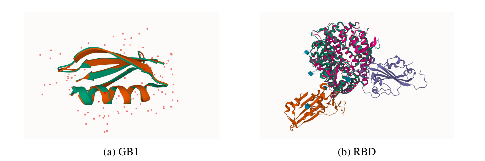

<!--v-->
## 关于蛋白质结构的BackGround
| 蛋白质基础结构 | SE(3) diffusion model  |
| --- | --- |
|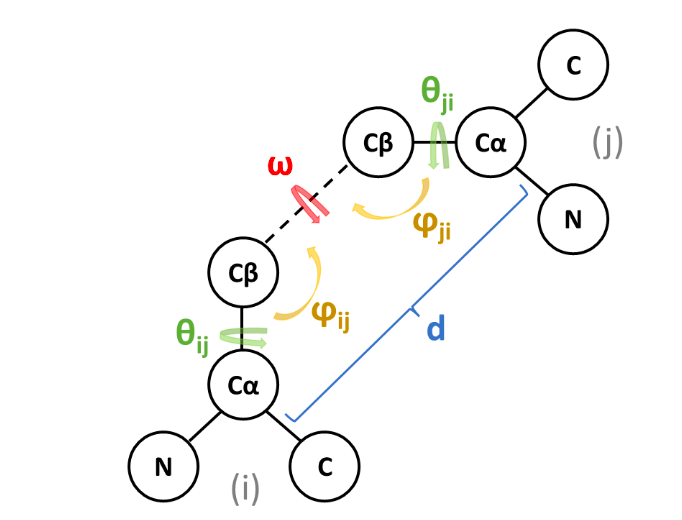| 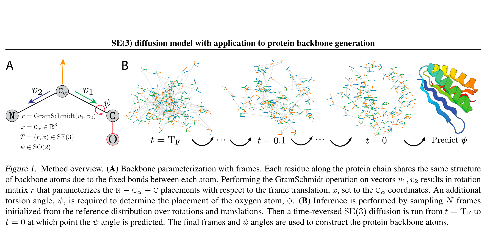 |

<!--v-->
## 蛋白质的重要性和挑战 
- 蛋白质由氨基酸的线性链组成，可折叠成特定的构象，决定了其功能
- 蛋白质结构确定的挑战导致蛋白质结构数据集相对较小
- 最近的工作利用未标记的蛋白质序列数据来学习蛋白质的有效表示
- 基于结构的蛋白质编码器和预训练方法的发展填补了蛋白质功能注释的差距
- 最新的蛋白质结构预测方法使得可以有效地预测大量蛋白质序列的结构
- ......

> SSF(Structure Sequence Function) is all you need!

<!--s-->

# Part.2 Related Work & Method

<!--v-->
## Protein Encoder
- 全原子级别的蛋白质结构编码器是十分重要的！！！
> 传统的蛋白质结构编码器主要基于图卷积网络(GCN)和自编码器(AE) —— 但是这些方法在处理全原子级别的蛋白质结构时存在一定的局限性（我们真的应当采取这样的方式吗？）

因而我们提出了一种新的蛋白质结构编码器，以适用于attetion-based的框架。

<!--v-->

## Backbone Representation
我们提出的骨干级表示的图示如下：
- ( a )氨基酸i骨架坐标系的构建
- ( b )计算两个氨基酸i和j的骨架坐标系之间的3个欧拉角
- ( c )说明了现有方法和我们提出的方法确定氨基酸i和j之间的相对旋转。紫色虚线表示现有方法如何通过计算沿链的所有主链二面角来确定i和j之间的相对旋转。黄箭头显示了我们的方法如何仅使用三个欧拉角来确定氨基酸i和j之间的相对旋转。

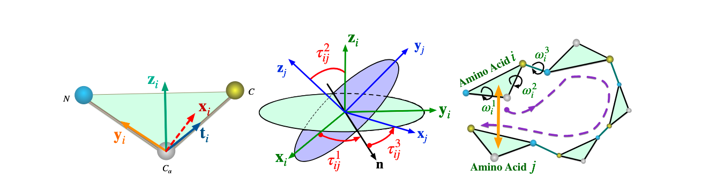

<!--v-->

## Residua Embedding
我们提出的残基嵌入的图示如下：
> 与alphaFold的残基嵌入相比，我们的残基未考虑`180-rotation-symmetric`,但由于原子名称给定，我们无需考虑这个问题。
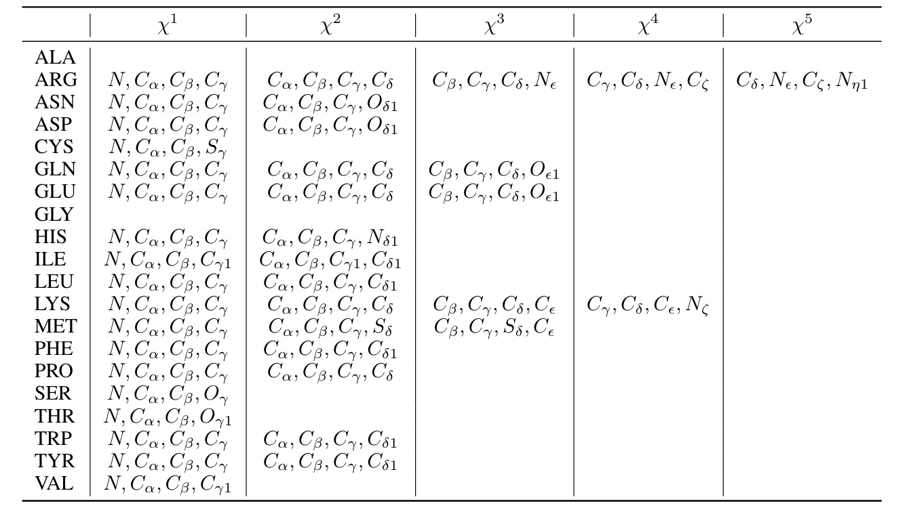

<!--v-->
## Attention-based Model
关于attention-based model选择，是因为其在处理全原子级别的蛋白质结构时具有更好的性能。
而关于如何将SS（Structure & Sequence Joint Information）的选择，我们做了如下的ablation study：
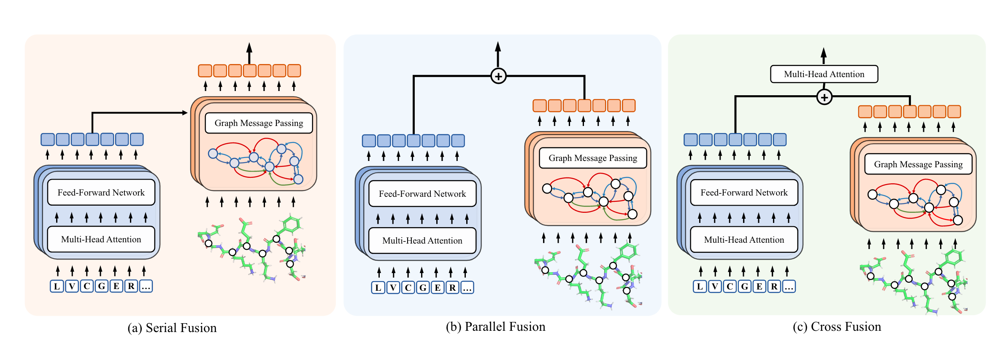

<!--v-->
## Contrastive Learning
- 对比学习是一种无监督学习方法，通过最大化正样本的相似性和负样本的差异性来学习数据的表示

> A blog about Contrastive Learning: [Contrastive Self-Supervised Learning](https://ankeshanand.com/blog/2020/01/26/contrative-self-supervised-learning.html)
> 

<!--v-->
## How to Train
结合上述我们所提供的知识，我们的训练模型如下:

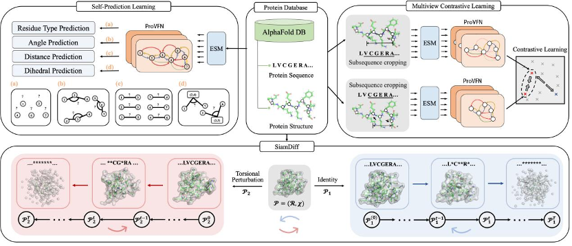

> Denoise to be continued......

<!--s-->

# Part.3 Experiment & Result

<!--v-->
## Different prediction
自预测方法。我们使用i、j、k、t来表示采样的残基索引。任务与各自的MLP头相关联：fres、fdis、fang和fdih。CE(·)是交叉熵损失，角度用bin(·)离散化。

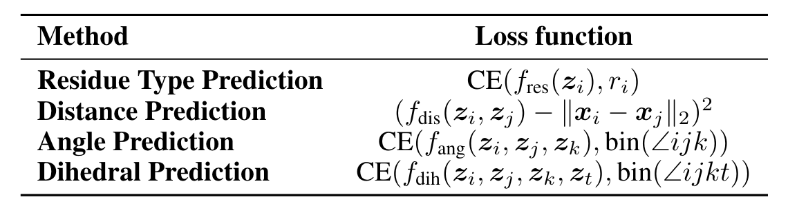

<!-- <section>
\[
\begin{array}{lc}
\hline \text { Method } & \text { Loss function } \\
\hline \text { Residue Type Prediction } & \operatorname{CE}\left(f_{\text {res }}\left(\boldsymbol{z}_{i}\right), r_{i}\right) \\
\text { Distance Prediction } & \left(f_{\text {dis }}\left(\boldsymbol{z}_{i}, \boldsymbol{z}_{j}\right)-\left\|\boldsymbol{x}_{i}-\boldsymbol{x}_{j}\right\|_{2}\right)^{2} \\
\text { Angle Prediction } & \left.\mathrm{CE}\left(f_{\text {ang }} \boldsymbol{z}_{i}, \boldsymbol{z}_{j}, \boldsymbol{z}_{k}\right), \operatorname{bin}(\angle i j k)\right) \\
\text { Dihedral Prediction } & \mathrm{CE}\left(f_{\text {dih }}\left(\boldsymbol{z}_{i}, \boldsymbol{z}_{j}, \boldsymbol{z}_{k}, \boldsymbol{z}_{t}\right), \operatorname{bin}(\angle i j k t)\right) \\
\hline
\end{array}
\]
</section> -->

<!--v-->

## Denoise Details

这些方法受到扩散模型在捕捉序列和结构的联合分布方面的成功启发。
在预训练过程中，对结构和序列应用噪声水平 $t\in\{1,..,T\}$，其中较高的水平表示较大的噪声。

编码器的表示用于通过以下损失函数进行去噪：

<math xmlns="http://www.w3.org/1998/Math/MathML" display="block"><mtable columnspacing="1em" rowspacing="4pt"><mtr><mtd><msub><mrow><mi data-mjx-variant="-tex-calligraphic" mathvariant="script">L</mi></mrow><mrow><mtext>struct&nbsp;</mtext></mrow></msub><mo>=</mo><msub><mrow><mi mathvariant="double-struck">E</mi></mrow><mrow><mi>t</mi><mo>∼</mo><mo fence="false" stretchy="false">{</mo><mn>1</mn><mo>,</mo><mo>…</mo><mo>,</mo><mi>T</mi><mo fence="false" stretchy="false">}</mo></mrow></msub><msub><mrow><mi mathvariant="double-struck">E</mi></mrow><mrow><mi>ϵ</mi><mo>∼</mo><mrow><mi data-mjx-variant="-tex-calligraphic" mathvariant="script">N</mi></mrow><mo stretchy="false">(</mo><mn>0</mn><mo>,</mo><mi>I</mi><mo stretchy="false">)</mo></mrow></msub><mrow data-mjx-texclass="INNER"><mo data-mjx-texclass="OPEN">[</mo><msubsup><mrow data-mjx-texclass="INNER"><mo data-mjx-texclass="OPEN">∥</mo><mi>ϵ</mi><mo>−</mo><msub><mi>f</mi><mrow><mtext>noise&nbsp;</mtext></mrow></msub><mrow data-mjx-texclass="INNER"><mo data-mjx-texclass="OPEN">(</mo><msup><mi mathvariant="bold-italic">z</mi><mrow><mo stretchy="false">(</mo><mi>t</mi><mo stretchy="false">)</mo></mrow></msup><mo>,</mo><msup><mi mathvariant="bold-italic">x</mi><mrow><mo stretchy="false">(</mo><mi>t</mi><mo stretchy="false">)</mo></mrow></msup><mo data-mjx-texclass="CLOSE">)</mo></mrow><mo data-mjx-texclass="CLOSE">∥</mo></mrow><mrow><mn>2</mn></mrow><mrow><mn>2</mn></mrow></msubsup><mo data-mjx-texclass="CLOSE">]</mo></mrow><mo>,</mo></mtd></mtr><mtr><mtd><msub><mrow><mi data-mjx-variant="-tex-calligraphic" mathvariant="script">L</mi></mrow><mrow><mtext>seq&nbsp;</mtext></mrow></msub><mo>=</mo><msub><mrow><mi mathvariant="double-struck">E</mi></mrow><mrow><mi>t</mi><mo>∼</mo><mo fence="false" stretchy="false">{</mo><mn>1</mn><mo>,</mo><mo>.</mo><mo>.</mo><mo>,</mo><mi>T</mi><mo fence="false" stretchy="false">}</mo></mrow></msub><munder><mo data-mjx-texclass="OP">∑</mo><mrow><mi>i</mi></mrow></munder><mi>CE</mi><mo data-mjx-texclass="NONE">⁡</mo><mrow data-mjx-texclass="INNER"><mo data-mjx-texclass="OPEN">(</mo><msub><mi>r</mi><mrow><mi>i</mi></mrow></msub><mo>,</mo><msub><mi>f</mi><mrow><mtext>res&nbsp;</mtext></mrow></msub><mrow data-mjx-texclass="INNER"><mo data-mjx-texclass="OPEN">(</mo><msubsup><mi mathvariant="bold-italic">z</mi><mrow><mi>i</mi></mrow><mrow><mo stretchy="false">(</mo><mi>t</mi><mo stretchy="false">)</mo></mrow></msubsup><mo data-mjx-texclass="CLOSE">)</mo></mrow><mo data-mjx-texclass="CLOSE">)</mo></mrow><mo>,</mo></mtd></mtr></mtable></math>

通过扭曲扰动生成相关构象，并在两个扩散轨迹之间进行相互去噪，SiamDiff增强了基于扩散的预训练。

> 其中，$f_{\text{noise}}$和$f_{\text{res}}$是去噪网络。

<!--v-->

## 热稳定性

**热稳定性**是指[物质](https://zh.wikipedia.org/wiki/%E7%89%A9%E8%B4%A8 "物质")在相对较高的[温度](https://zh.wikipedia.org/wiki/%E6%B8%A9%E5%BA%A6 "温度")下阻止其化学或物理结构被破坏或出现变化的能力。如果一个物质热稳定性好，它遇到高温时就不容易出现[分解反应](https://zh.wikipedia.org/wiki/%E5%88%86%E8%A7%A3%E5%8F%8D%E5%BA%94 "分解反应")或与其他物质[聚合](https://zh.wikipedia.org/wiki/%E8%81%9A%E5%90%88 "聚合")。[[1]](https://zh.wikipedia.org/zh-cn/%E7%83%AD%E7%A8%B3%E5%AE%9A%E6%80%A7#cite_note-1)这些热稳定性好的物质被视为耐热材料，他们是[阻燃剂](https://zh.wikipedia.org/wiki/%E9%98%BB%E7%87%83%E5%89%82 "阻燃剂")的原料。热稳定性也是一些[蛋白质](https://zh.wikipedia.org/wiki/%E8%9B%8B%E7%99%BD%E8%B4%A8 "蛋白质")的特性。热稳定性好的蛋白质在高温环境下其[蛋白质结构](https://zh.wikipedia.org/wiki/%E8%9B%8B%E7%99%BD%E8%B4%A8%E7%BB%93%E6%9E%84 "蛋白质结构")也能保持稳定。

https://www.bopuyun.com/article/94258?zch=seoggs

研究发现，某些单克隆抗体药物虽然在体外实验中表现出良好的药物活性，但在进入临床试验阶段却会遭遇到体内活性降低的问题［4］

<!--v-->
## 抗体分子设计
因此在药物研发的初期就要兼顾其药效动力学的问题。**抗体药物的稳定性是影响抗体药效动力学的关键因素之一**，首先抗体的高亲和力与高特异性都需要以稳定的结构为基础，这是其正确行使生物学功能的保障。其次，抗体的稳定性越高，则其新生肽链在细胞内装配时产生错误折叠（mis-folding）的概率越低，可溶性表达量也越高［5］。

**良好的热稳定性所带来的紧凑结构使抗体的蛋白酶切位点更不易暴露，并其影响药品保质期及存放条件，关系到药物成本**。目前，提高蛋白质热稳定性的方法主要有非共价修饰、化学修饰、添加蛋白质稳定剂、蛋白质工程，以及在液体状态利用矿化技术直接在蛋白表面形成磷酸钙矿化外壳以提高蛋白质的稳定性［6］ 。

> 由此可见，在保证抗体亲和力及表达量等性质不受太大影响的情况下，最大程度上提高其稳定性，对抗体药物的研发具有重要的现实意义。

<!--v-->

## Downstream Task

我们在Atom3D上评估了我们提出的方法在功能注释和结构属性预测任务中的有效性

Four key downstream tasks are considered:

**1. Enzyme Commission (EC) Number Prediction:** This task involves predicting EC numbers that describe a protein's catalytic behavior in biochemical reactions. It's formulated as 538 binary classification problems based on the third and fourth levels of the EC tree [Webb, 1992]. We use dataset splits from Gligorijevic et al. (2021) and test on sequences with up to 95% identity cutoff.

<!--v-->

**2. Gene Ontology (GO) Term Prediction:** This benchmark includes three tasks: predicting a protein's biological process (BP), molecular function (MF), and cellular component (CC). Each task is framed as multiple binary classification problems based on GO term annotations. We employ dataset splits from Gligorijevic et al. (2021) with a 95% sequence identity cutoff.

**3. Protein Structure Ranking (PSR):** This task involves predicting global distance test scores for structure predictions submitted to the Critical Assessment of Structure Prediction (CASP) [Kryshtafovych et al., 2019]. The dataset is partitioned by competition year.

<!--v-->

**4. Mutation Stability Prediction (MSP):** The goal is to predict if a mutation enhances a protein complex's stability. The dataset is divided based on a 30% sequence identity.

<!--v-->

## Result

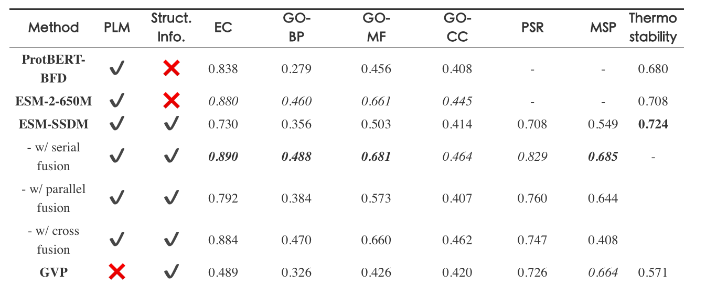

<!--v-->

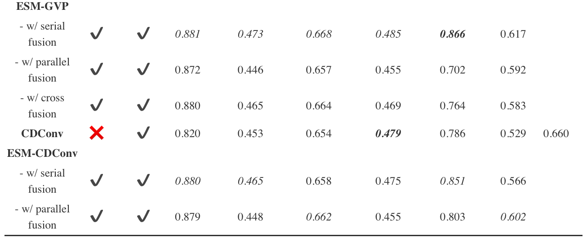

<!-- | **Method**           | **PLM** | **Struct. Info.** | **EC**      |      | **GO-BP**   |      | **GO-MF**   |      | **GO-CC**   |      | **PSR**     |      | **MSP**     | Thermo stability |
| -------------------- | ------- | ----------------- | ----------- | ---- | ----------- | ---- | ----------- | ---- | ----------- | ---- | ----------- | ---- | ----------- | ---------------- |
| **ProtBERT-BFD**     | ✔️       | ❌                 | 0.838       |      | 0.279       |      | 0.456       |      | 0.408       |      | -           |      | -           | 0.680            |
| **ESM-2-650M**       | ✔️       | ❌                 | _0.880_     |      | _0.460_     |      | _0.661_     |      | _0.445_     |      | -           |      | -           | 0.708            |
| **ESM-SSDM**         | ✔️       | ✔️                 | 0.730       |      | 0.356       |      | 0.503       |      | 0.414       |      | 0.708       |      | 0.549       | **0.724**        |
| - w/ serial fusion   | ✔️       | ✔️                 | **_0.890_** |      | **_0.488_** |      | **_0.681_** |      | _0.464_     |      | _0.829_     |      | **_0.685_** | -                |
| - w/ parallel fusion | ✔️       | ✔️                 | 0.792       |      | 0.384       |      | 0.573       |      | 0.407       |      | 0.760       |      | 0.644       |                  |
| - w/ cross fusion    | ✔️       | ✔️                 | 0.884       |      | 0.470       |      | 0.660       |      | 0.462       |      | 0.747       |      | 0.408       |                  |
| **GVP**              | ❌       | ✔️                 | 0.489       |      | 0.326       |      | 0.426       |      | 0.420       |      | 0.726       |      | _0.664_     | 0.571            |
| **ESM-GVP**          |         |                   |             |      |             |      |             |      |             |      |             |      |             |                  |
| - w/ serial fusion   | ✔️       | ✔️                 | _0.881_     |      | _0.473_     |      | _0.668_     |      | _0.485_     |      | **_0.866_** |      | 0.617       |                  |
| - w/ parallel fusion | ✔️       | ✔️                 | 0.872       |      | 0.446       |      | 0.657       |      | 0.455       |      | 0.702       |      | 0.592       |                  |
| - w/ cross fusion    | ✔️       | ✔️                 | 0.880       |      | 0.465       |      | 0.664       |      | 0.469       |      | 0.764       |      | 0.583       |                  |
| **CDConv**           | ❌       | ✔️                 | 0.820       |      | 0.453       |      | 0.654       |      | **_0.479_** |      | 0.786       |      | 0.529       | 0.660            |
| **ESM-CDConv**       |         |                   |             |      |             |      |             |      |             |      |             |      |             |                  |
| - w/ serial fusion   | ✔️       | ✔️                 | _0.880_     |      | _0.465_     |      | 0.658       |      | 0.475       |      | _0.851_     |      | 0.566       |                  |
| - w/ parallel fusion | ✔️       | ✔️                 | 0.879       |      | 0.448       |      | _0.662_     |      | 0.455       |      | 0.803       |      | _0.602_     |                  | -->

<!--v-->

## Result
ESM-SSDM (serial fusion) results on EC and GO-MF with different learning rate ratios.
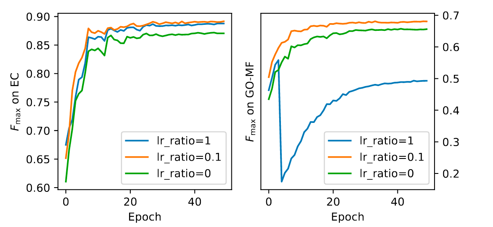

<!--v-->
## Dataset
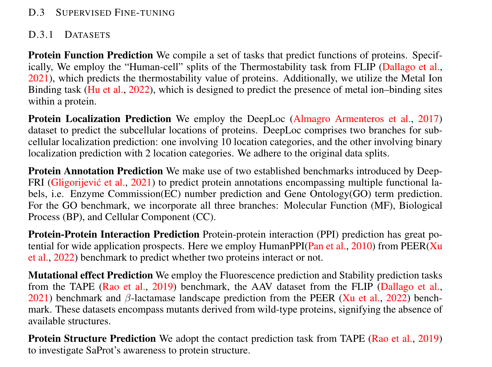

<!--v-->
## Moreover...
当然，我们也可以将一些众多下游任务作为我们的评价指标

<!--s-->

# Part.4 Discussion

<!--v-->
## 关于一点点RL
我始终认为，目前基于MLP的主流模型思想始终源于一些人类意识的探索思考，而强化学习的潜能始终未被完全挖掘，尤其在for science领域......
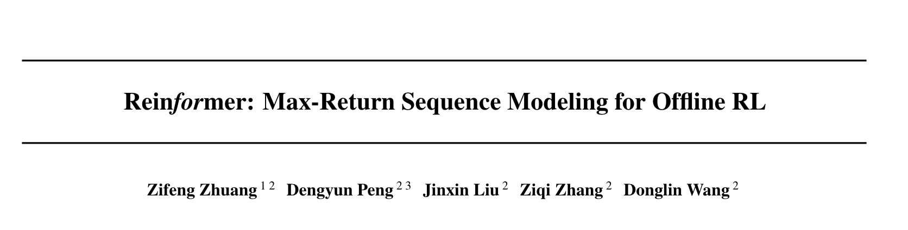

<!--v-->
## 图例

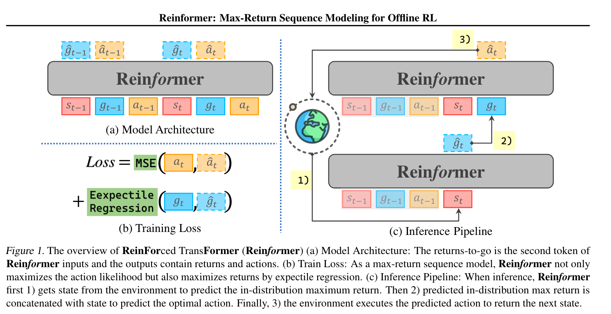

<!--s-->

# 感谢聆听

> 恳请批评指正！

<!--v-->
## 参考文献
[1]	Bin Ma and Richard Johnson. De novo sequencing and homology searching. Molecular & cellular proteomics, 11(2), 2012.

[2]	Bin Ma. Novor: real-time peptide de novo sequencing software. Journal of the American Society for Mass Spectrometry, 26(11):1885–1894, 2015.

[3]	Yue Cao, Payel Das, Vijil Chenthamarakshan, Pin-Yu Chen, Igor Melnyk, and Yang Shen. Fold2seq: A joint sequence(1d)-fold(3d) embedding-based generative model for protein design.

<!--v-->

[4]	Bowen Jing, Stephan Eismann, Pratham N. Soni, and Ron O. Dror. Learning from protein structure with geometric vector perceptrons. In International Conference on Learning Representations, 2021.

[5]	Pedro Hermosilla, Marco Schäfer, Matˇ ej Lang, Gloria Fackelmann, Pere Pau Vázquez, Barbora Kozlíková, Michael Krone, Tobias Ritschel, and Timo Ropinski. Intrinsic-extrinsic convolution and pooling for learning on 3d protein structures.

[6]	Ahmed Elnaggar, Michael Heinzinger, Christian Dallago, Ghalia Rehawi, Wang Yu, Llion Jones, Tom Gibbs, Tamas Feher, Christoph Angerer, Martin Steinegger, Debsindhu Bhowmik, and Burkhard Rost. Prottrans: Towards cracking the language of lifes code through self-supervised deep learning and high performance computing.

<!--v-->

[7]	Pedro Hermosilla and Timo Ropinski. Contrastive representation learning for 3d protein structures. In Submitted to The Tenth International Conference on Learning Representations, 2022.

[8]	Limei Wang, Haoran Liu, Yi Liu, Jerry Kurtin, and Shuiwang Ji. Learning protein representations via complete 3d graph networks. ArXiv, abs/2207.12600, 2022a.

[9]	John Jumper, Richard Evans, Alexander Pritzel, Tim Green, Michael Figurnov, Olaf Ronneberger, Kathryn Tunyasuvunakool, Russ Bates, Augustin Žídek, Anna Potapenko, et al. Highly accurate protein structure prediction with alphafold. Nature, 596(7873):583–589, 2021.
